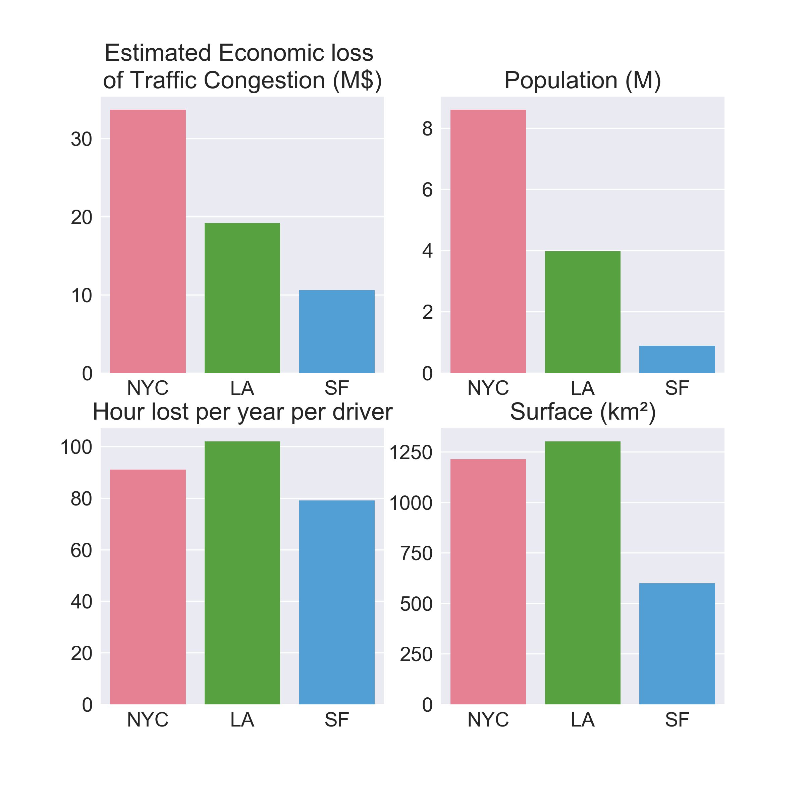
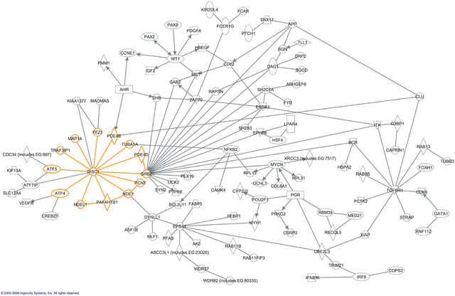
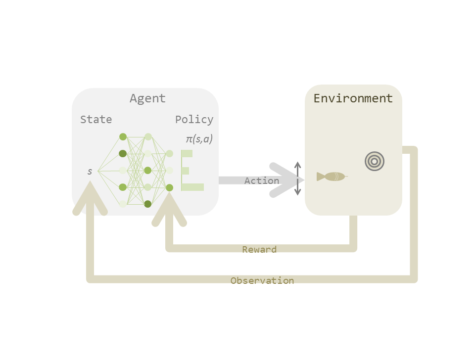
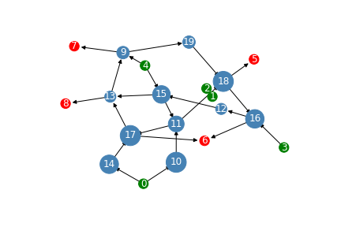

### Traffic congestion

Traffic congestion, also known as traffic jam, is a complex problem with no 
definitive answer. Increased economic prosperity leads to a considerable 
growth in urban traffic demands. This over usage of road infrastructures 
coupled with stochastic events often leads to traffic jams inducing
delays for the users and other negative impacts such as wasting time, 
wasting fuel, increased air pollution, increased vehicles maintenance, 
human health problems, or emergency service degradation, to name a few.

> __Definition:__
> Network congestion is the number of actors passing through a point
> in a defined time window.

According to the largest study on global traffic from [INRIX](http://inrix.com/scorecard/),
, the traffic congestion cost is 305 billion $ in 2017 in U.S. 

These statistics suggest a correlation between economic loss and
 number of drivers. Interestingly, the longest congestion time
correlates with city size and thus road network size.

If we think about it, traffic networks are similar to natural networks, such 
as biological or ecological networks.

These networks are rarely congested thanks to regulatory mechanism that 
auto-adapt traffic demands. Could we design regulatory mechanisms that 
can handle road traffic as efficiently as natural networks ?

### Reinforcement Learning

> __Definition:__
> Reinforcement learning is a process that map situation to actions.

In reinforcement learning, the learner must discover this mapping by
trial and error and evaluation with a delayed reward.

Given a state _s_ resuming the observations from an environment, 
an agent must decide which action _a_ to take. At first, the rules
of the environment are not known, thus the agent will take random 
actions. Following action, the environment will return a signal
to the agent, called the reward _r_, to evaluate its success in 
accomplishing the task. The reward signal is then utilized by the 
agent to update its policy so that the next time it encounter the
same state it has a higher probability of choosing the right
action to get a success.

Recent advances in Deep Learning had a huge impact on Reinforcement
Learning by broadening the state space that the agent can ingest
to predict actions. For example, deep nets such as convolutional
networks allows agent to observe the environment directly from
pictures.

### AI controlled traffic

From the literature, there is no satisfactory theoretical model
of network traffic and its congestion. It is thus tempting to 
develop some empirical predictive models that could help us
regulate traffic flows with the goal of limiting traffic congestion.

Current research is focused on traffic light control at intersection.
In this work, we would like to consider the traffic network (or sub-network)
as whole for the reinforcement learning problem. Here, we are more 
interested in optimizing the congestion level of the whole network, 
than optimizing travel time for the users of the network. Indeed,
 it is likely that optimizing one traffic light at an intersection 
 could cause traffic congestion at another intersection.The rational
behind this approach is that traffic network congestion is dependent
on both network architecture and usage.  We anticipate that a RL agent 
will make the best use of the whole network usage compared to informations
 at intersections only. 
 
### Simulation

#### Network modelling

According to the definition of traffic congestion, we care about 
the **number of actors** going through a **road** during a 
**time** period.

The unit is the road. Roads can have different sizes and contains
different number of actors. We choose to represent the roads as nodes
and intersections as edges to easily extract roads informations. Nodes
have a single index while edges have 2 indices (node1,node2).

We defined a class for the generation of random graph with fixed number of
entry, exit and core nodes. The creation of edges are randomized and 
parameterized with the number of paths and the path depths.

Core nodes have a max capacity visualized by the size of the node. This
max capacity indicates how many actors can be in that node in a time step.
We can parameterize further this measure by its length * width.

Actors are moving from an entry node to an exit node chosen randomly. The 
actor follow the shortest path. Depending on the structure of the network, 
many actors may be in the same nodes at the same time, which will increase
the congestion of the network.

Nodes are connected by edges which have an adjustable parameter indicating
the number of actors going through that intersection in a timestep. This 
parameter should be in `[1,Max_flow - degree - 1]` to avoid blocking 
totally the intersection.

#### State space

The measure of congestion of each nodes is assessed by the number of actors 
in that node divided by its max capacity. This is similar to what we can 
observe on Google map with the traffic feature on, where roads are colored
from green to dark-red (4 levels) to indicate congestion of each road. This measure
is derived from the density of mobile phone users. This annonymized data can be
accessed in realtime by contracting with mobile phone providers. This may be more
economically viable compared to cameras and IT infrastructure for all traffic
lights in the city. 

#### Action space

The network flow will be adjusted by issuing a bounded percentage change
in edge capacity [-0.5; +0.5]. The sum capacity of output edges from one node
should be constant. This mean that the total number of cars moving at an 
intersection in a cycle (step) is constant. Since all actors need to stop
at intersection, going through the intersection is a constant time (same speed).
Factor that can influence the flow at intersections are the widths of 
connected roads. This flow is limited by the smallest width of the two 
connected nodes (1 to 3 lanes). Actions are used to prioritize the traffic 
at intersections. Action will be for each node (edge, percent). The flow through
the other edges of the same intersection should be adjusted accordingly.

#### Rewards

Reward design is a complex task. The scalar representing the reward that we will
use to guide our reinforcement learning machine must summarize the behaviour
we expect to achieve.

Our expectations are:
- all entering actors can exit the network
- low time travel (at best 1 node per timestep) is better
- no nodes reach full capacity

Our current reward function combines the network outputs in number of actors compared to previous step
and the fluidity of the network (1 - mean congestion).

We can test the addition of mean output delay for actors. Each actor can record its travel time. 
If an actor is stuck in the network it should penalize the agent over time. Meanwhile, when actors
exit the network, it will decrease mean time travel. The normalization factor could be the path length.
The measure could then be the path_len / travel_time. The highest the better. We could then combine
this mean speed measure with the fluidity of the network for a reward.

Another reward measure to test would be the mean number of steps to go through
enter to exit node for each actors. At timestep t, we will collect all starting times
of actors in exit nodes and compute the mean travel time. While the previous reward
is immediate, this one is delayed to a future time window.

#### Memory

Deep nets are trained with data batches. In the context of reinforcement 
learning, it means that we cannot train only on the data of the current 
timestep. We need to store experiences in a memory and draw random
samples at training time. While current approaches use an independant
memory table to store (states, actions, reward, states+1), in this context
of a graph, it will be advantageous to store states in nodes and actions in edges.
